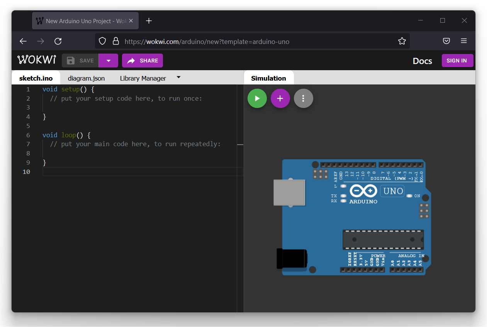

# ArduinoCalculNextDate

arduino-calcul-next-date

Petit exercice de programmation ;-)

Depuis la plateforme [WOKWI](https://wokwi.com/) pour [simuler le code Arduino](https://wokwi.com/arduino/new?template=arduino-uno) afin de tester le programme :

## Enoncé 

Vous réaliserez un programme en C vérifiant si une date saisie par l'utilisateur est valide.
Si c'est bien la cas, votre programme affichera alors la date du jour suivant.

Exemple: Le jour apres la date du 31/12/1582 est le 1/1/1583

### Conditions pour qu'une date soit valide

- Une année est supérieure ou égale à 1582.
- Les règles utilisées pour les années bissextiles sont celles du [calendrier Gregorien ](https://fr.wikipedia.org/wiki/Calendrier_gr%C3%A9gorien)instauré en 1582. L'année sera bissextile si :
  - l'année est divisible par 4 et non divisible par 100, ou
  - l'année est divisible par 400.
- Les mois de numéro 1,3,5,7,8,10 et 12 comportent 31 jours.
- Les mois de numéro 4,6,9 et 11 comportent 30 jours
- Le mois numéro 2 (février) comporte :
  - 29 jours si l'année est bissextile
  - 28 jours sinon
